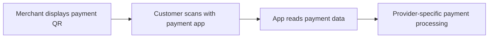
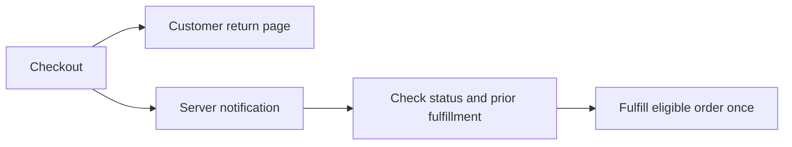

# Week 2 Learning Notes: Digital Payment Systems

Industry and Community Engagement · Learning log started on 8 September 2026

**Status:** All three assigned courses completed on 8 September 2026, with official certificates checked. Verified chapter-quiz results total **30/30**: FinTech **20/20** and generative AI in finance **10/10**. The accepted 2025 edition of Digital Marketing Foundations provides no chapter quizzes.

These notes record the learning, source checks, worked examples and development goals. My selected local portfolio evidence includes one real FinTech study photograph, the three course certificates and selected course screenshots.

## My learning focus

My Week 1 work considered e-commerce. In Week 2, I am examining how digital financial services support online transactions and how this knowledge can contribute to my professional development. I want to explain the purpose of a financial technology, the people and organisations involved, and the limits of the benefits it promises.

The Week 2 lecture also connected independent learning with a professional portfolio and personal development planning. I am using the online courses to build subject knowledge, then turning that knowledge into examples, critical observations and practical next steps. A completion certificate will establish completion; the notes and applied examples will show what I can explain and use.

My Week 1 reflection linked my PDP to teamwork, checking original sources and explaining a practical service challenge. I carry those priorities into this week through purposeful communication with my teacher and analysis of the payment experience. The provider-documentation check below is one completed step; implementing a service or conducting user testing remains future work.

## Course 1 — Introduction to Fintech

Source: Corporate Finance Institute, [Introduction to Fintech on LinkedIn Learning](https://www.linkedin.com/learning/introduction-to-fintech).

**Completion:** Completed on 8 September 2026. The official LinkedIn Learning certificate records the 49-minute course. My local evidence includes a study photograph, a course screenshot, separate course notes and the certificate.

### What I understand by FinTech

I understand FinTech as the use of technology to improve financial products, services and processes. Digital payments are one part of this field. Other areas include banking, funding, investment management, insurance and compliance.

The course gives me three useful questions for evaluating an application:

1. Does it improve access to financial services?
2. Does it improve the customer experience or the efficiency of a process?
3. How does it change the services and choices available in the market?

These questions give me a basis for analysis. A claim about convenience or inclusion still needs evidence from the specific product and setting.

### Development of digital finance

| Broad period discussed in the course | Developments | Connection I draw |
| --- | --- | --- |
| Late 1990s and 2000s | Online payments, online lending, mobile financial services and automated investment services | Internet access created new ways to deliver financial services and support e-commerce. |
| 2010s | Digital wallets, mobile payments, crowdfunding, blockchain, InsurTech and open banking | Smartphones and data connectivity brought financial services into everyday activities. |
| 2020s | Wider use of digital banking, AI and machine learning, digital identity and decentralised finance | Increasing digitisation creates opportunities alongside questions about identity, trust and control. |

I use this timeline to organise the course's broad themes. It does not imply that every technology or company first appeared in the period in which it is discussed.

### Online payments and digital wallets

I distinguish payment processing from funds transfer. Payment processing includes receiving, validating and authorising an electronic payment. A funds transfer concerns money moving between accounts or people, including domestic and international transfers.

A digital wallet provides a way to initiate payments and manage financial information or assets. It can connect to other services and infrastructure. I therefore need to distinguish the wallet interface, a payment service provider, a card network and a bank when describing a particular transaction.

**My applied example:** In a hypothetical online purchase, a customer selects a mobile wallet at checkout. The merchant uses a payment service to accept the transaction, and other financial participants support authorisation and the movement of funds. This example helps me connect the visible checkout experience with the processes behind it.

### Applying the learning — a QR payment example

EMVCo distinguishes two payment modes: a customer can scan a merchant's QR code, or display a code for the merchant to scan. Its specifications define the QR data format; providers determine subsequent payment messaging. This helps me separate the payment entry point from the processing behind it. [Source: EMVCo, EMV QR Codes](https://www.emvco.com/emv-technologies/qr-codes/).

My diagram illustrates the first mode at a conceptual level:

**My analysis:** I would examine what happens if the app reads unexpected payment details, the network fails, or the payment status is unclear. A useful design should help the customer check the intended recipient and understand the result before deciding whether to retry. These are evaluation questions for my scenario, to be checked against a specific provider's documented behaviour.

I also checked EMV payment tokenisation. It substitutes a payment token for the primary account number and can constrain token use to a device, merchant or payment scenario. My takeaway is that payment security can involve limiting the usefulness of exposed data. [Source: EMVCo, EMV Payment Tokenisation](https://www.emvco.com/emv-technologies/payment-tokenisation/).

### Digital banking and financial inclusion

The course refers to neobanks as digital banks. Online platforms and mobile applications can provide services such as opening accounts, applying for loans and managing investments. Reducing dependence on physical branches can make some services easier to access and allow providers to automate processes.

**My critical observation:** Access to an application is only part of financial inclusion. A person may still face barriers involving internet access, a suitable device, digital skills or identity requirements. When I evaluate a service, I need to ask which users benefit and which users may remain excluded.

The course also raises deposit protection. I should examine the entity providing a service and the applicable protection arrangements when studying a specific digital bank. A convenient interface does not by itself establish the provider's regulatory status or the protection available.

### Alternative funding

Alternative funding includes ways of obtaining finance beyond a conventional bank loan. The course introduces online lending, peer-to-peer lending and crowdfunding. My focus is on identifying who supplies the money, what the platform does, and what the funder receives in return.

Peer-to-peer lending connects borrowers with lenders through a platform. Crowdfunding gathers contributions from many participants and can involve different arrangements, including rewards, equity or debt. These arrangements should not be treated as equivalent: a reward is different from ownership, and both differ from a repayment obligation.

**My critical observation:** A faster application or wider access to funding does not remove credit or project risk. I need to discuss the conditions behind the benefit, including repayment obligations, information quality and the possibility that a borrower or project may fail.

### What the first chapter quiz helped me consolidate

The questions reinforced the connection between smartphones and mobile payments, the meaning of digital banking, and the role of technology in widening access to financial services. They also helped me distinguish broad personal finance functions from narrower activities such as investment advice.

The four chapter quiz results were confirmed as **5/5, 8/8, 4/4 and 3/3**, giving **20/20** overall.

### Personal finance, insurance and AI

Personal finance management tools can aggregate account information, track spending and support budgeting. Accounting automation can reduce repeated work in bookkeeping, expense tracking, invoicing and reporting. I connect both applications to data quality: incorrect inputs or categories can affect the conclusions drawn from a dashboard or report.

InsurTech applies technology to activities such as underwriting, claims and risk assessment. The course's examples include vehicle data and insurance linked to usage. This makes me consider a trade-off between personalisation and the amount of information collected about a customer.

AI and machine learning can identify patterns or anomalies, support fraud detection, automate service tasks and assist investment analysis. I understand machine learning as a part of the broader field of AI.

**My critical observation:** For a payment fraud model, I would evaluate both missed fraud and legitimate payments incorrectly flagged. A system that blocks many genuine customers could undermine the convenient payment experience it is supposed to support. I would also examine how a flagged decision can be reviewed and how changing transaction patterns affect performance.

### RegTech and consumer protection

RegTech supports organisations with compliance tasks such as identity verification, monitoring, risk management and reporting. I distinguish the provider of a compliance tool from the regulator responsible for oversight.

The course links regulation to consumer protection, financial stability, the prevention of financial crime and conditions for innovation. For a digital payment service, I would examine whether costs and risks are understandable, how account and transaction information is protected, and how a customer can obtain help when something goes wrong.

**My critical observation:** Automation needs accountable review. An identity match or transaction alert can require further investigation, and a report depends on the quality of its source data. If I refer to a particular legal obligation or reporting deadline, I will verify the original rule and its conditions with the relevant authority.

The course also introduces regulatory sandboxes as a way to test innovation under controlled conditions and discusses cooperation between authorities when services operate across borders. This connects product design with the scope of a test, the evidence it should produce, and the jurisdictions in which a service operates.

I checked the GDPR example against Article 6. Consent is one legal basis for processing; the Article also includes contractual necessity and legal obligations. This showed me why an introductory quiz answer needs context before I use it in a formal analysis. [Source: GDPR, Article 6](https://eur-lex.europa.eu/eli/reg/2016/679/art_6/oj/eng).

### Evaluating future technologies

| Direction discussed in the course | Possible application | What I would investigate |
| --- | --- | --- |
| VR and AR | Virtual service interactions, financial education and visualisation | Whether the experience improves understanding or task completion, and who can access the required equipment. |
| Quantum computing | Risk modelling and portfolio optimisation | A clearly defined problem, a comparison with existing methods and realistic operating conditions. |
| Blockchain and DeFi | Peer-to-peer exchange and smart contracts | How rules and inputs are checked, and how errors or disputes are handled. |
| AI in financial regulation | Support for compliance, analysis and service tasks | Output quality, oversight, review and the ability to trace a decision. |
| Wearables and the internet of things | Contactless payments and personalised services | Convenience alongside the scope of data collection and meaningful user control. |

I treat the future-facing examples as directions to evaluate. Their value depends on evidence from the intended setting. I can use the same method across topics: identify the user need, explain the process, examine the conditions and risks, and check whether the claimed improvement is demonstrated.

### What this changes in my approach

My Week 2 analysis now has a more specific structure. I can connect the customer-facing payment experience to the organisations, data and controls behind it. The QR diagram made me distinguish an entry point from payment processing; the GDPR source check showed why precise conditions matter when I use a course example.

For my next development step, I will take one documented payment flow and explain its participants, normal result and failure handling. I will assess my understanding by explaining the flow in my own words and identifying a convenience benefit, an access barrier and a security consideration. This gives me a concrete basis for updating my PDP and preparing the Theme 2 reflection.

## Course 2 — Digital Marketing Foundations

Source: Brad Batesole, [Digital Marketing Foundations on LinkedIn Learning](https://www.linkedin.com/learning/digital-marketing-foundations-26945172). This version was published on 26 September 2025 and is listed as 2 hours 9 minutes. **Completed on 8 September 2026; the official course certificate has been verified.** This edition has no chapter quizzes. My local evidence includes the two edition screenshots, separate course notes and the certificate. One real FinTech classroom photograph is included in my W2 portfolio selection.

### Discussing the course version with my teacher

The original module link opened the archived 2022 edition. I asked my teacher whether I could use the newer edition and received confirmation that this was acceptable. I then changed to the updated course on 8 September 2026.

This gave me a practical example of taking responsibility for my learning: I identified a change in the resource, checked that an alternative met the teacher's expectations, and adjusted my study plan. I am retaining the two course links and page screenshots to explain the change. The record of the discussion is my account of the conversation; the screenshots show the course pages.

Original link: [Digital Marketing Foundations (2022)](https://www.linkedin.com/learning/digital-marketing-foundations-15054577/connecting-with-customers-online).

### My starting understanding

The opening lesson connects digital marketing with using channels, data and technology to reach customers. The updated course discusses AI-assisted content creation, predictive content and real-time recommendations. I distinguish these functions: producing a draft, estimating what may interest a group, and adapting a recommendation are different tasks with different evidence requirements.

My connection to Week 2 is the journey from a customer's first contact with a business to a completed payment. I want to understand which information builds confidence and how a payment experience supports or interrupts the customer's intended action.

**My critical observation:** A relevant recommendation may encourage a purchase, but predicted interest does not establish what an individual wants. I will examine how a proposed use of customer data relates to the task, what the customer understands about it, and how the result can be checked.

### AI, privacy and a connected customer experience

The next lesson connects changing tracking practices with greater attention to first-party data, discusses generative AI for content production, and explains omnichannel experiences. I understand first-party data in terms of the direct relationship through which it is collected; I still need to examine the purpose and conditions of a specific use.

Omnichannel marketing focuses on continuity across customer touchpoints. The course's shopping-cart example helps me distinguish this from simply operating several channels. For a payment scenario, I would investigate whether the order, amount and payment status remain understandable when a customer changes device. I would test inconsistent data or repeated submissions before claiming that the journey is reliable.

**My critical observation:** Generating content variants quickly is useful only when the information is accurate and appropriate. I would check product facts and misleading wording before evaluating engagement. A faster workflow still needs a clear review step.

### Paid, owned and earned media

I distinguish paid placement, channels and content a business manages, and attention generated through other people's sharing or commentary. One social platform can contain all three. I therefore classify the activity by how it is produced and distributed, rather than by the platform name alone.

For my payment example, I would compare the promise made in an advertisement, the information provided at checkout, and customers' accounts of the experience. An unclear fee or payment result could weaken the confidence created earlier in the journey. This is a hypothesis to investigate in a defined scenario.

### From the marketing funnel to the payment journey

The course uses awareness, interest, desire and action to organise the marketing funnel, then adds loyalty and advocacy after purchase. I use these stages as a guide while recognising that customers may pause, compare alternatives or return later.

The buyer-journey lesson explicitly connects hesitation with unclear prices, confusing websites and limited trust in online payments. This gives me a direct link between the marketing course and digital payment systems.

**My applied exercise:** For a hypothetical mobile purchase, I would follow product discovery, comparison, the shopping cart, payment selection, confirmation and support. At each point I would record the customer's task, required information and possible barrier. At checkout, I would examine the total cost, supported methods, verification steps and the meaning of the final payment status.

This exercise has not been tested on a live service. I have now taken a first verification step by reading a provider's fulfillment documentation, as recorded below.

### Checking a documented payment process

I checked Stripe's Checkout fulfillment guide. A payment can succeed even if the customer loses connectivity before reaching the return page. Its documented approach uses server notifications, checks payment status and prevents repeated order fulfillment; delayed payment methods need later success or failure handling. [Source: Stripe, Fulfill orders](https://docs.stripe.com/checkout/fulfillment).

My conceptual diagram records the distinction:

**My inference:** A clear confirmation page and dependable order processing must work together. I would check that a customer can understand a pending result and that repeated notifications cannot create duplicate fulfillment. This is documentation analysis; I have not implemented or tested a payment integration.

### Personalisation and learning through feedback

The course distinguishes recommendations, actions triggered by customer behaviour and dynamically adapted content. I would consider alternative explanations for a signal: visiting a pricing page could indicate comparison or confusion as well as an intention to buy. My proposed trigger should be evaluated against customer feedback and the risk of unwanted interruptions.

Agile marketing uses repeated cycles of planning, action, feedback and adjustment. I connect this with my learning method: explain a concept through a concrete question, identify what I cannot yet support, and check or revise it. Asking my teacher about the course version and consulting a payment provider's documentation are two actions I have already taken in this study session.

### Defining value in terms a customer can assess

The value-proposition lesson asks me to connect a customer problem, a useful outcome and a reason to choose the proposed solution. For my hypothetical checkout scenario, supporting several payment methods is a feature; helping the intended customer find a usable method and understand the payment result is the intended experience.

My draft aim is to provide a clear mobile checkout that explains the amount, available methods and next step. I have not demonstrated an advantage over another service. A meaningful comparison would need a specified alternative and common evaluation criteria.

### Identifying an audience without assuming its needs

Segmentation groups customers using relevant characteristics, interests or behaviour. For my checkout example, I would start with tasks and context: a first-time visitor, a returning user and a person with limited connectivity may need different support. These are hypotheses to validate, rather than established findings about real customers.

AI clustering can suggest patterns, but I would examine the data and the reason for each grouping. More detailed segmentation is useful only when it helps answer a meaningful question and is supported by suitable evidence.

### A provisional customer persona

I drafted a persona for the applied exercise: a first-time mobile customer who wants to understand the full amount, choose a usable payment method and confirm the order outcome. The proposed support includes understandable verification steps, clear status messages and a visible help route.

This persona organises my questions. It has no invented interview quotations or survey findings. The course's emphasis on evolving personas means I would revise it using observed behaviour and customer explanations, rather than treating the initial profile as a fixed description.

### Setting a measurable development goal

The SMART framework helps me specify an outcome, how I will assess it and when I will complete it. I would interpret views or likes in relation to a defined purpose; they do not independently demonstrate sales or a better customer experience.

My proposed PDP action is to complete an annotated payment-journey analysis by **15 September 2026**, using official sources and comparing three situations: verified success, a payment still processing and a browser that has not displayed the result. I will identify the participants, required customer information, a convenience benefit and an access or reliability limitation. I have completed the initial documentation check; the full scenario comparison is a further step.

### KPI exercise: the denominator changes the question

The course connects KPIs with the purpose of a campaign and discusses weighted engagement and LTV:CAC. I would state the weighting, time horizon and cost or value definitions before interpreting either measure.

For a calculation exercise, I used **hypothetical data**, not customer records or project results: 500 sessions, 80 sessions starting checkout and 40 purchasing sessions in the same observation period, with at most one counted purchase conversion per session.

| Measure | Calculation | Result |
| --- | --- | --- |
| Session visit-to-purchase conversion | 40 / 500 | 8% |
| Completion among sessions that started checkout | 40 / 80 | 50% |

Both results are compatible. They answer different questions. Before claiming that conversion improved, I would specify the event, denominator, period and comparison. The exercise demonstrates my understanding of the measure; it does not demonstrate a real performance improvement.

### Bringing the example into a compact plan

| Element | My current draft for the hypothetical shop |
| --- | --- |
| Problem and audience | A first-time mobile customer may need clearer checkout information. |
| Intended value | Understand the amount, available payment methods and next step. |
| Proposed content | Explanations at checkout, confirmation and help touchpoints. |
| Business connection | Support an intended purchase and provide understandable order information. |
| Costs to consider | Content creation, maintenance and customer-support time; no cost estimate has been established. |
| Measures | Defined visit-to-purchase and checkout-completion measures, alongside customer understanding. |
| Review | Compare documentation and pages, then revise the plan using feedback. |

The one-page-plan lesson helped me check whether the audience, message, proposed service and measures support the same purpose. I can update this draft as the evidence develops.

### Asking useful data questions and understanding growth loops

The messaging lesson starts with the information needed to address a customer's concern. For my example, I would investigate how a first-time customer understands fees and payment instructions, then relate the findings to the wording at that touchpoint.

Growth loops connect an existing user's experience with the arrival of new users through mechanisms such as referrals or shareable features. I would evaluate useful participation and retention alongside sharing counts and incentive costs. In a payment setting, trust in the underlying service and control over what information is shared would shape my assessment.

### Events, content consistency and channel choice

The analytics lesson uses GA4's event model to explain observation of actions such as clicks, downloads and purchases. This reinforces my need for clear event definitions before interpreting a KPI. The server-side-tagging discussion also made me consider where data is processed, which fields are forwarded and how the resulting quality and performance would be checked.

For a coherent online presence, the course discusses separating content management from its presentation across channels. My concern is that core information remains consistent while formats suit each touchpoint. In a checkout journey, I would check for outdated amounts or instructions after an update.

Channel selection starts with the audience's behaviour, suitable content and available resources. Historical data or predictions can guide a choice, but subsequent results still need review. The information that matters to a purchase should be available where the customer needs it.

### Checking the cost assumptions behind a priority

The prioritisation lesson introduces ROI and the CAC payback period. I checked its simplified ROI example against Google Ads guidance, whose example includes production and advertising costs. My takeaway is to state the cost boundary and distinguish sales revenue from profit before comparing returns. [Source: Google Ads, About ROI](https://support.google.com/google-ads/answer/1722066?hl=en).

For a forecast-based priority, I would record the assumptions and consider whether the conclusion changes when they change. A single attractive ratio would not explain the full decision.

### Adapting a message while keeping the facts consistent

The messaging lesson connects audience needs with the emphasis, language, channel and call to action. In my example, a first-time customer may benefit from more explanation while a familiar user may focus on the current amount and status. The fees, conditions and help route should remain understandable across versions.

I would state what the adaptation changes, why that change suits the task and what evidence would show that it helps.

I applied the lean-messaging lesson in a small writing exercise. For a hypothetical button that opens a payment-review page, I changed “Please click here to continue to the next step” to **“Review payment details.”** The revision names the task more directly. It is an authored example, not a change to a live checkout or a tested improvement. Concision should retain information needed to understand the amount, conditions and status.

### Website quality as part of payment access

The website-optimisation lesson connects speed, relevant information, usability and content structure. In my mobile-checkout example, I would examine whether loading delays obstruct the task, whether amounts and conditions are easy to find, and whether the instructions match the process.

This connects with financial inclusion: devices, connectivity and digital skills can affect how people complete the same task. My evaluation should name the user context and the specific difficulty, then compare the interface with the documented service behaviour.

The website-copywriting lesson breaks dynamic content into modules such as headlines, calls to action and product descriptions. For my example, I would record which version appears under each condition and check that its promised action matches the next step. This connects the writing exercise with the behaviour of a page.

### A landing page should fulfil the promise of its entry point

The landing-page lesson emphasises a defined action and consistency between the incoming advertisement or link and the page's heading, content and offer. I would first identify why the visitor arrived and what task the page should support.

I distinguish a marketing landing page from checkout: one may help a visitor explore or start a purchase; the other handles the information and steps needed to buy. Removing distractions should preserve conditions and access to help. When comparing versions, I would examine a defined conversion measure alongside whether customers understand the page correctly.

### Connecting website content with the next action

The course's Netflix case brings together website optimisation, concise copy, landing pages with different purposes and personalised recommendations. I took from it the need to connect a page's stated value with an appropriate next action.

For my checkout analysis, I would define the task before checking whether the heading, button, fee explanation and following page agree. If I compared versions, I would define the measures in advance and record what changed. A brand example gives me questions to investigate; it does not establish that the same design will work in my context.

### Separating search visibility, AI references and business outcomes

The course connects SEO with visibility in search results and GEO with inclusion in generated answers. I distinguish an appearance in an answer, a website visit and a purchase when deciding what to measure.

I checked Google Search Central: foundational SEO practices remain relevant to Google's AI Overviews and AI Mode, without additional special optimisation requirements. Meeting requirements does not guarantee that content will appear. [Source: Google Search Central, AI features and your website](https://developers.google.com/search/docs/appearance/ai-features).

My priority would be accurate, clearly organised content that answers a real question, followed by evaluation for a specified platform and observation period. An AI reference alone would not demonstrate increased sales, and one provider's guidance does not establish rules for every service.

### Paid media: distinguish the charged action from the business goal

The paid-advertising lesson introduces charging for actions such as clicks, impressions or views. PPC concerns clicks, while CPM expresses cost per thousand impressions. I would describe the charging model separately from the intended business outcome.

I used **hypothetical data** for a second calculation exercise: £120 of advertising spend, 30,000 impressions, 600 clicks and 24 recorded purchase conversions in the same period.

| Measure | Calculation | Result |
| --- | --- | --- |
| Cost per thousand impressions | £120 / 30,000 × 1,000 | £4 |
| Average cost per click | £120 / 600 | £0.20 |
| Cost per recorded purchase conversion | £120 / 24 | £5 |

These are three views of the same example, not three simultaneous charging arrangements. The costs include advertising spend only, rather than all acquisition costs. The figures do not establish additional purchases caused by advertising. For an actual campaign, I would state attribution, other costs and a comparison baseline.

### Customer lifetime value depends on stated assumptions

The customer-value lesson looks beyond the first purchase. Its simplified LTV estimate combines average purchase value, purchase frequency per period, the number of periods and a profit margin.

I would check consistent time units, which costs the margin includes and the evidence for expected retention. Before comparing LTV with CAC, I would align their scope and examine whether a shorter relationship or lower margin changes the decision. This connects retention with the cost exercise while keeping the uncertainty visible.

### Work backwards from the target, then revise the budget

The budgeting lesson connects funnel stages, intended results, acceptable costs and conversion assumptions. I would define the target first, estimate the required visits or clicks and state which expenses the budget covers.

The suggested stage allocations provide starting points. In my plan, I would first locate the difficulty in the customer journey, then select an action and measure. An initial test should produce actual cost and conversion information that can change the next allocation.

### Turn campaign setup into a review sequence

The campaign-creation lesson connects the objective, business information, targeting, advertisement, landing page and budget. I translated this into a review order for my hypothetical plan: align the objective and audience, check the promise against the page, then examine costs, conversion recording and the review schedule.

Even when a platform adjusts bids or content automatically, I need to judge whether its optimisation target matches the problem I intend to address. Suggested settings provide a starting point; performance and page facts require continuing review.

### Different platform participants need different objectives

The Airbnb case uses guests and hosts to discuss differences in audience, customer value and calls to action. I use it as an analytical example rather than verified current advertising data.

For digital payments, a customer completing a payment and a merchant considering service integration have different tasks. I would define the necessary information, next action and completion measure for each. Combining their conversions without explaining the distinction would obscure what the activity achieved.

### Social content should suit the reason people use a channel

The social-strategy lesson compares uses such as short video, professional discussion, timely conversation and visual discovery. I would begin with the user's purpose, then select the format and emphasis.

In my payment example, a short demonstration could explain one action, a professional article could examine participants and business needs, and help content could address specific questions. These formats have different tasks while retaining consistent facts. I would test the choice against current platform guidance and feedback, rather than treating the course's algorithm descriptions as permanent rules.

The platform-selection lesson adds audience presence, relevant creators, content formats and the capacity to produce consistently. Competitor activity can suggest where to investigate; the final choice still needs to fit my objective, resources and audience evidence.

### Engagement and purposeful content reuse

The audience-building lesson emphasises useful, consistent content and adapting material across formats. I understand reuse as reorganising length, format and emphasis while retaining accurate core information.

The flow diagrams in these notes explain processes; the calculation tables clarify measures; the prose develops my reasoning. Their different purposes help me choose a format for the reader's question. When evaluating engagement, I would examine what the feedback says and whether it reveals misunderstanding or helps improve an explanation.

### Creator partnerships need evidence of fit

The micro-influencer lesson emphasises niche relevance and relationships. I would examine audience fit, substantive interaction, accurate product explanation, partnership cost and the planned evaluation.

A smaller follower count does not itself establish greater trust or better results. For payment-related content, I would check clear conditions, transparency about the relationship and customer understanding. Reach and clicks need this context before I interpret their value.

### A social-content case also informs my portfolio structure

The Nike case introduces Hero–Hub–Help: major attention-building content, continuing series and material that answers practical questions. I focus on their different communication purposes.

This helps me assess my professional portfolio. An overview should establish the learning topic, continuing notes should show how my understanding develops, and diagrams or examples should explain specific problems. I would organise these materials so a reader can follow the relationship between completion evidence, learning activity and analysis.

### Email relevance starts with the communication's purpose

The email lesson discusses subscriber preferences and relevant interactions as inputs to more useful content. I would first establish what subscribers expect to receive, then consider which information supports that purpose. A past purchase does not fully describe a person's interests.

In a payment journey, I would distinguish the purpose of an order or payment notification from promotional email. Essential transaction information should be recognisable and understandable, with a clear basis for any adaptation and a way to examine its result.

### An email sequence needs conditions for changing or stopping

The email-planning lesson connects objectives, segments, automated sequences, content, timing and tests. I added four questions to my hypothetical plan: what triggers the content, what each step should help achieve, when it should arrive and what changes or stops the sequence.

For checkout, I would review the plan when a purchase completes, a problem is resolved or subscription preferences change. This connects the sequence with the customer's current situation. It is planning analysis; I have not built an automation or sent emails.

### Check email metric denominators and observation limits

The measurement lesson introduces opens, clicks, conversions, bounces, unsubscribes and list growth. I checked Mailchimp's definitions to distinguish two measures:

| Mailchimp measure | Denominator |
| --- | --- |
| Click rate | Successfully delivered emails |
| Clicks per unique opens | Recipients registered as having opened the email |

Both concern clicks, but answer different questions. I would specify the event, denominator and deduplication before interpreting a percentage. [Source: Mailchimp, About Email Reports](https://mailchimp.com/help/about-email-campaign-reports/).

Apple explains that Protect Mail Activity downloads remote content in the background by default, regardless of engagement. My inference is that a load record does not establish actual reading. [Source: Apple, Mail Privacy Protection](https://www.apple.com/legal/privacy/data/en/mail-privacy-protection/).

I would examine how reported events arise, then interpret them alongside the intended conversion, delivery problems, unsubscribes and feedback. A sudden change warrants checking definitions and data quality before attributing it to customer behaviour.

### Evaluate email tools against the planned task

The tools lesson gives me functional requirements to examine: list management, segmentation, editing, automation, reporting, integrations, delivery and cost. I would evaluate how these support the plan and maintain consistent data across systems.

For my example, I would check whether order updates affect later messages, whether report definitions are clear and how costs change with subscriber or sending volume. The named products are starting points for investigation; a real selection requires current feature and pricing checks.

### Choose key signals, then investigate anomalies

The analytics lesson starts with business objectives, a small set of meaningful signals and anomaly detection to identify what needs investigation. A longer report does not itself establish better analysis.

I treat an anomaly as a lead to investigate. For a hypothetical fall in checkout conversion, I would first check event definitions, recording completeness, comparison periods and traffic sources before proposing an explanation about the page or customer behaviour. A rise in email opens also needs the observation checks discussed above. Any proposed cause should come with evidence that could test it.

### A short report exercise separates observation, interpretation and action

The reporting lesson connects audience, purpose, KPIs, context and recommendations. I used the earlier **hypothetical checkout data** to write a compact report:

| Report element | My exercise |
| --- | --- |
| Observation | 80 sessions started checkout and 40 purchased: 50% completion among starters. |
| Supported interpretation | This identifies a stage to investigate. Without a comparison baseline, it does not establish a page defect. |
| Checks needed | Event definitions, recording completeness, observation period, traffic sources and customer understanding of payment information. |
| Proposed action | Compare checkout explanations with documentation and complete the three payment-result scenarios, then decide what interface or user validation is needed. |

The exercise helps me separate an observation, a hypothesis and a proposed action. A useful report should make both the direction and its evidence limitations understandable.

## Course 3 — Leveraging Generative AI in Finance and Accounting

Source: Glenn Hopper, [Leveraging Generative AI in Finance and Accounting](https://www.linkedin.com/learning/leveraging-generative-ai-in-finance-and-accounting). The course page lists 48 minutes and an update date of 1 July 2025. **Completed on 8 September 2026; the official certificate has been checked.** All four chapter quizzes are completed and verified as **3/3, 3/3, 2/2 and 2/2 — 10/10 in total**.

### Generation, simulation and evidence

The opening material discusses generating new outputs from learned patterns and using simulated scenarios in financial analysis. I distinguish a plausible generated result from a verified fact or a reliable forecast. Producing many scenarios does not establish that their assumptions or probabilities represent the situation being studied.

This connects with my earlier work on payment states and marketing measures: I need to identify the input, state the task, check the output and explain its limitations. For a financial summary, I would trace numbers to their source and recompute calculations before using the explanation.

### FP&A: turn a natural-language question into a defined calculation

FP&A means financial planning and analysis. The lesson discusses natural-language interaction and domain-specific information. I would still specify the period, units, inputs and assumptions, then verify the output.

I completed a **hypothetical calculation exercise** for a fictional business: revenue of £100,000 and specified operating costs of £70,000, with revenue increasing by 10% and those costs by 5%.

| Item | Baseline | Changed scenario |
| --- | --- | --- |
| Revenue | £100,000 | £110,000 |
| Specified operating costs | £70,000 | £73,500 |
| Revenue less these costs | £30,000 | £36,500 |

The difference increases by £6,500. Recomputing the two components shows why subtracting 5% from 10% would not give the growth rate of the resulting difference. This is a simplified arithmetic exercise; tax, financing, working capital and other items are outside its scope.

### Identify the scope of a model example

The models lesson explains a generator and discriminator trained against each other. I checked Goodfellow and colleagues' original paper and identify this as a **generative adversarial network (GAN)** example, rather than treating that structure as a definition of all generative AI. [Source: Generative Adversarial Networks](https://arxiv.org/abs/1406.2661).

This adds a question to my learning practice: is an explanation defining the whole topic or illustrating one method? Stating the scope helps me decide where I can apply the explanation.

### Easier access to analysis still requires judgement

The data-science lesson discusses using natural language to request analysis and reduce the amount of code a user must write. I still need to define the business question, select relevant variables, make fair comparisons and interpret the result.

For my hypothetical revenue exercise, this means specifying the baseline, changes, units and calculation boundary. A subsequent quarterly forecast would also need an appropriate observation period, attention to seasonality, candidate explanatory variables and a validation method. The tools named in the lesson describe its demonstration environment; current capabilities would need checking for actual use.

This connects with digital-marketing analytics: producing a chart or forecast should lead to an explanation of what it measures, which assumptions it uses and what further evidence is needed.

### Translate ethical principles into questions about a service

The ethics lesson highlights fairness, transparency and accountability, alongside effects on employees, customers and communities. I applied these ideas to a **hypothetical payment-risk review**:

| Principle | Question I would investigate |
| --- | --- |
| Fairness | Are new users with little history more likely to be wrongly flagged? What data and group comparisons would establish this? |
| Transparency | Can users understand the current status, why further information is requested and what to do next? Does the explanation match the process? |
| Accountability | Who can review a disputed decision, correct an error and record the outcome? Does the reviewer have authority to change it? |

This is scenario analysis; I have not tested a risk model. An overall accuracy or cost-saving figure would not, by itself, establish that a service works appropriately for every group. I would also check a generated explanation against the relevant records and process before treating it as an account of how a decision was made.

### Check what a controls report actually covers

The compliance lesson draws attention to records of inputs, processing and outputs, and reassessment as systems change.

AICPA describes SOC 2 in terms of service-organisation controls concerning security, availability, processing integrity, confidentiality or privacy. My inference is that such a report should not be treated as proof that every AI financial conclusion is accurate. I would examine its scope and findings, then check the particular output. [Source: AICPA, SOC 2](https://www.aicpa-cima.com/topic/audit-assurance/audit-and-assurance-greater-than-soc-2/).

I also checked the lesson's reference to public reports. AICPA identifies SOC 3 as a general-use report that can be freely distributed; I would not assume that a particular SOC 2 report is public. [Source: AICPA, SOC 3](https://www.aicpa-cima.com/topic/audit-assurance/audit-and-assurance-greater-than-soc-3).

I would distinguish evidence about the provider's controls, my own handling of data and verification of the analysis. Each answers a different question about using the service.

### My output-checking exercise: arithmetic, labels and certainty

Using my fictional business figures, I constructed three sample claims to check. This is a notes exercise, not a real company report or a measured model test.

| Sample claim | My check and correction |
| --- | --- |
| “The difference grew by 5%, because 10% minus 5% is 5%.” | The correct denominator is the original £30,000 difference: £6,500 ÷ £30,000 ≈ 21.67%. |
| “Net income is £36,500.” | The label exceeds the calculation's scope. I calculated revenue less specified operating costs; tax, financing and other items remain outside it. |
| “Next quarter will definitely produce £36,500.” | This turns a conditional scenario into a certain forecast. The arithmetic result depends on the stated revenue, cost and scope assumptions. |

The exercise distinguishes a calculation error, a definition error and an unsupported conclusion. Correcting one does not establish that the other checks have passed.

### Annual-report case: trace one claim to the original table

The lesson uses Apple's fiscal 2024 Form 10-K to explore business performance, risks and strategy. I treat a citation as an entry point for verification and open the source to examine whether it supports the claim.

I checked the products and services table on report page 23 and recalculated the iPad change:

| Measure (USD millions) | FY2023 | FY2024 | My calculation |
| --- | --- | --- | --- |
| iPad net sales | 28,300 | 26,694 | (26,694 − 28,300) ÷ 28,300 ≈ −5.67% |

Rounded to a whole percentage, this is a 6% decrease, consistent with the report and lesson. [Source: Apple, 2024 Form 10-K, p. 23](https://www.sec.gov/Archives/edgar/data/320193/000032019324000123/aapl-20240928.htm).

This completed check connects a claim with its original table, units, period and calculation. It verifies one statement; it does not validate an entire generated summary or forecast, and I do not present historical figures as current performance.

### Financial-statement analysis: preserve meaning when tidying data

The instructor demonstrates structured data for the income statement, balance sheet and cash-flow statement, followed by charts and DuPont analysis. I record my understanding of the demonstration; I have not reproduced the instructor's full analysis.

My preparation checks would preserve statement names, row definitions, currency, units, periods and original references after removing visual formatting. I would distinguish quarterly and cumulative figures, balances at a date and flows over a period, and inspect missing values and negative signs.

A chart needs a defined question. When interpreting a change in ROE, I would examine the contributions of profit margin, asset use and leverage before judging operating performance. I would also state calculation conventions and factors affecting comparisons.

The connection to marketing data is practical: tidier tables still need event definitions, denominators and observation periods to support interpretation.

### Forecasting: evaluate performance beyond the fitted data

The final case compares a linear trend with SARIMA and discusses industry knowledge, product cycles and economic conditions. I treat it as a demonstration of candidate methods. A more complex or seasonal-looking curve does not establish better forecasting performance.

The final quiz shortens the name to ARIMA; my method notes retain SARIMA, the seasonal model explicitly demonstrated in the video.

I checked the evaluation guidance in *Forecasting: Principles and Practice*: accuracy should be assessed on new observations excluded from fitting; good fit to training data is insufficient. [Source: section 5.8](https://otexts.com/fpp3/accuracy.html).

I wrote a plan for a later exercise: define the target, units, quarter convention and forecast horizon; reserve later periods for evaluation; compare candidates with a simple baseline using the same available information; then examine errors and limitations. Any business assumptions should have a stated basis and conditions for revision. This is a completed validation plan, not a trained or tested forecasting model.

## My next steps and evidence of progress

| Action | Why it matters | Evidence I will produce |
| --- | --- | --- |
| Completed: FinTech course and chapter quizzes | Build a more complete account of the field and identify misunderstandings. | Learning notes, four completed quizzes and the official course certificate. |
| Completed: Digital Marketing Foundations | Connect customer needs, communication, cost and measurement. | Course certificate, edition screenshots, notes, calculation and writing exercises, and a short report exercise. |
| Completed: first provider-documentation check using Stripe Checkout | Examine a specific payment process alongside the earlier conceptual QR example. | A source-backed diagram and analysis of confirmation, delayed status and repeated fulfillment requests. |
| Compare convenience, inclusion and risk in that scenario | Develop a balanced reflection supported by a concrete example. | A short analysis covering a benefit, a limitation and a response. |
| Completed: generative AI in finance course | Examine applications, output checking and limitations. | Separate course notes, 10/10 chapter quizzes, official certificate, source and arithmetic checks. |
| Completed: update my personal development goals | Turn the learning into specific actions and progress checks. | The two goals below connect service analysis with clearer communication. |

### Updated PDP goals

By **15 September 2026**, I will complete an annotated payment journey for confirmed success, a pending result and a missing browser confirmation. Each scenario will identify the customer's next step, supporting evidence and remaining uncertainty. The initial documentation check is completed; the full scenario analysis remains to be developed.

By the same date, I will seek **one peer's feedback** on the clarity of my explanation and revise at least one part, retaining the feedback and both versions. I have not yet obtained this feedback. This develops my communication goal alongside source checking and practical service analysis.

My learning photograph and course screenshot are retained with my local portfolio evidence. This repository provides a readable record of my notes and their development. It supports the portfolio alongside the required reflection and other evidence.

## Sources and related work

- Week 2 lecture supplied in the module learning materials, studied on 8 September 2026.
- Corporate Finance Institute, [Introduction to Fintech](https://www.linkedin.com/learning/introduction-to-fintech), LinkedIn Learning.
- Brad Batesole, [Digital Marketing Foundations, updated edition](https://www.linkedin.com/learning/digital-marketing-foundations-26945172), LinkedIn Learning, published 26 September 2025.
- Glenn Hopper, [Leveraging Generative AI in Finance and Accounting](https://www.linkedin.com/learning/leveraging-generative-ai-in-finance-and-accounting), LinkedIn Learning, course page updated 1 July 2025.
- EMVCo, [EMV QR Codes](https://www.emvco.com/emv-technologies/qr-codes/) and [EMV Payment Tokenisation](https://www.emvco.com/emv-technologies/payment-tokenisation/), consulted on 8 September 2026.
- European Union, [General Data Protection Regulation, Article 6](https://eur-lex.europa.eu/eli/reg/2016/679/art_6/oj/eng).
- Stripe, [Fulfill orders with Checkout](https://docs.stripe.com/checkout/fulfillment), consulted on 8 September 2026.
- Google Ads, [About return on investment](https://support.google.com/google-ads/answer/1722066?hl=en), consulted on 8 September 2026.
- Google Search Central, [AI features and your website](https://developers.google.com/search/docs/appearance/ai-features), consulted on 8 September 2026.
- Apple, [Mail Privacy Protection & Privacy](https://www.apple.com/legal/privacy/data/en/mail-privacy-protection/), consulted on 8 September 2026.
- Mailchimp, [About Email Reports](https://mailchimp.com/help/about-email-campaign-reports/), consulted on 8 September 2026.
- Goodfellow et al., [Generative Adversarial Networks](https://arxiv.org/abs/1406.2661), 2014.
- AICPA & CIMA, [SOC 2](https://www.aicpa-cima.com/topic/audit-assurance/audit-and-assurance-greater-than-soc-2/) and [SOC 3](https://www.aicpa-cima.com/topic/audit-assurance/audit-and-assurance-greater-than-soc-3), consulted on 8 September 2026.
- Apple Inc. (2024), [Form 10-K for the fiscal year ended 28 September 2024](https://www.sec.gov/Archives/edgar/data/320193/000032019324000123/aapl-20240928.htm), p. 23.
- Hyndman and Athanasopoulos, [Forecasting: Principles and Practice, section 5.8](https://otexts.com/fpp3/accuracy.html), consulted on 8 September 2026.
- [My Week 1 e-commerce repository](https://github.com/hansu650/ice-week1-ecommerce-poster).

The applied examples and critical observations above are my analysis of the learning material and the cited sources.
