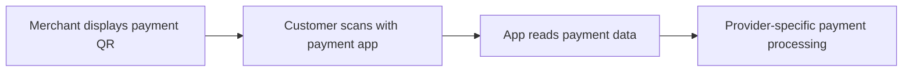

# Week 2 Learning Notes: Digital Payment Systems

Industry and Community Engagement · Learning log started on 8 September 2026

**Status:** In progress. These notes record the material I have covered and the questions I am developing. Course completion and certificates are recorded only after confirmation on the learning platform.

## My learning focus

My Week 1 work considered e-commerce. In Week 2, I am examining how digital financial services support online transactions and how this knowledge can contribute to my professional development. I want to explain the purpose of a financial technology, the people and organisations involved, and the limits of the benefits it promises.

The Week 2 lecture also connected independent learning with a professional portfolio and personal development planning. I am using the online courses to build subject knowledge, then turning that knowledge into examples, critical observations and practical next steps. A completion certificate will establish completion; the notes and applied examples will show what I can explain and use.

## Course 1 — Introduction to Fintech

Source: Corporate Finance Institute, [Introduction to Fintech on LinkedIn Learning](https://www.linkedin.com/learning/introduction-to-fintech).

### What I understand by FinTech

I understand FinTech as the use of technology to improve financial products, services and processes. Digital payments are one part of this field. Other areas include banking, funding, investment management, insurance and compliance.

The course gives me three useful questions for evaluating an application:

1. Does it improve access to financial services?
2. Does it improve the customer experience or the efficiency of a process?
3. How does it change the services and choices available in the market?

These questions give me a basis for analysis. A claim about convenience or inclusion still needs evidence from the specific product and setting.

### Development of digital finance

| Broad period discussed in the course | Developments | Connection I draw |
| --- | --- | --- |
| Late 1990s and 2000s | Online payments, online lending, mobile financial services and automated investment services | Internet access created new ways to deliver financial services and support e-commerce. |
| 2010s | Digital wallets, mobile payments, crowdfunding, blockchain, InsurTech and open banking | Smartphones and data connectivity brought financial services into everyday activities. |
| 2020s | Wider use of digital banking, AI and machine learning, digital identity and decentralised finance | Increasing digitisation creates opportunities alongside questions about identity, trust and control. |

I use this timeline to organise the course's broad themes. It does not imply that every technology or company first appeared in the period in which it is discussed.

### Online payments and digital wallets

I distinguish payment processing from funds transfer. Payment processing includes receiving, validating and authorising an electronic payment. A funds transfer concerns money moving between accounts or people, including domestic and international transfers.

A digital wallet provides a way to initiate payments and manage financial information or assets. It can connect to other services and infrastructure. I therefore need to distinguish the wallet interface, a payment service provider, a card network and a bank when describing a particular transaction.

**My applied example:** In a hypothetical online purchase, a customer selects a mobile wallet at checkout. The merchant uses a payment service to accept the transaction, and other financial participants support authorisation and the movement of funds. This example helps me connect the visible checkout experience with the processes behind it.

### Applying the learning — a QR payment example

EMVCo distinguishes two payment modes: a customer can scan a merchant's QR code, or display a code for the merchant to scan. Its specifications define the QR data format; providers determine subsequent payment messaging. This helps me separate the payment entry point from the processing behind it. [Source: EMVCo, EMV QR Codes](https://www.emvco.com/emv-technologies/qr-codes/).

My diagram illustrates the first mode at a conceptual level:

**My analysis:** I would examine what happens if the app reads unexpected payment details, the network fails, or the payment status is unclear. A useful design should help the customer check the intended recipient and understand the result before deciding whether to retry. These are evaluation questions for my scenario, to be checked against a specific provider's documented behaviour.

I also checked EMV payment tokenisation. It substitutes a payment token for the primary account number and can constrain token use to a device, merchant or payment scenario. My takeaway is that payment security can involve limiting the usefulness of exposed data. [Source: EMVCo, EMV Payment Tokenisation](https://www.emvco.com/emv-technologies/payment-tokenisation/).

### Digital banking and financial inclusion

The course refers to neobanks as digital banks. Online platforms and mobile applications can provide services such as opening accounts, applying for loans and managing investments. Reducing dependence on physical branches can make some services easier to access and allow providers to automate processes.

**My critical observation:** Access to an application is only part of financial inclusion. A person may still face barriers involving internet access, a suitable device, digital skills or identity requirements. When I evaluate a service, I need to ask which users benefit and which users may remain excluded.

The course also raises deposit protection. I should examine the entity providing a service and the applicable protection arrangements when studying a specific digital bank. A convenient interface does not by itself establish the provider's regulatory status or the protection available.

### Alternative funding

Alternative funding includes ways of obtaining finance beyond a conventional bank loan. The course introduces online lending, peer-to-peer lending and crowdfunding. My focus is on identifying who supplies the money, what the platform does, and what the funder receives in return.

Peer-to-peer lending connects borrowers with lenders through a platform. Crowdfunding gathers contributions from many participants and can involve different arrangements, including rewards, equity or debt. These arrangements should not be treated as equivalent: a reward is different from ownership, and both differ from a repayment obligation.

**My critical observation:** A faster application or wider access to funding does not remove credit or project risk. I need to discuss the conditions behind the benefit, including repayment obligations, information quality and the possibility that a borrower or project may fail.

### What the first chapter quiz helped me consolidate

The questions reinforced the connection between smartphones and mobile payments, the meaning of digital banking, and the role of technology in widening access to financial services. They also helped me distinguish broad personal finance functions from narrower activities such as investment advice.

The platform marks the first chapter quiz as viewed.

### Personal finance, insurance and AI

Personal finance management tools can aggregate account information, track spending and support budgeting. Accounting automation can reduce repeated work in bookkeeping, expense tracking, invoicing and reporting. I connect both applications to data quality: incorrect inputs or categories can affect the conclusions drawn from a dashboard or report.

InsurTech applies technology to activities such as underwriting, claims and risk assessment. The course's examples include vehicle data and insurance linked to usage. This makes me consider a trade-off between personalisation and the amount of information collected about a customer.

AI and machine learning can identify patterns or anomalies, support fraud detection, automate service tasks and assist investment analysis. I understand machine learning as a part of the broader field of AI.

**My critical observation:** For a payment fraud model, I would evaluate both missed fraud and legitimate payments incorrectly flagged. A system that blocks many genuine customers could undermine the convenient payment experience it is supposed to support. I would also examine how a flagged decision can be reviewed and how changing transaction patterns affect performance.

## Courses still to be developed

| Course assigned through the Week 2 learning materials | My planned focus | Status |
| --- | --- | --- |
| Digital Marketing Foundations | Connect customer needs and the online customer journey with the payment experience. | Notes to follow after study. |
| Leveraging Generative AI in Finance and Accounting | Examine useful applications, limitations and the need to check generated outputs. | Notes to follow after study. |

## My next steps and evidence of progress

| Action | Why it matters | Evidence I will produce |
| --- | --- | --- |
| Complete the remaining FinTech sections and chapter quizzes | Build a more complete account of the field and identify misunderstandings. | Updated learning notes and the platform's completion record. |
| Extend the QR payment diagram with one provider's documented flow | Move from a conceptual diagram to a specific, verifiable example. | Participant roles, payment status handling and source references. |
| Compare convenience, inclusion and risk in that scenario | Develop a balanced reflection supported by a concrete example. | A short analysis covering a benefit, a limitation and a response. |
| Study the remaining assigned courses | Extend the analysis to marketing and AI in finance. | Separate course notes and verified completion evidence. |
| Update my personal development plan before finalising Theme 2 | Turn the learning into an explicit development goal. | A specific goal, an action and a way to check progress. |

My learning photograph and course screenshot are retained with my local portfolio evidence. This repository provides a readable record of my notes and their development. It supports the portfolio alongside the required reflection and other evidence.

## Sources and related work

- Week 2 lecture supplied in the module learning materials, studied on 8 September 2026.
- Corporate Finance Institute, [Introduction to Fintech](https://www.linkedin.com/learning/introduction-to-fintech), LinkedIn Learning.
- [My Week 1 e-commerce repository](https://github.com/hansu650/ice-week1-ecommerce-poster).

The applied examples and critical observations above are my analysis of the learning material and the cited sources.
