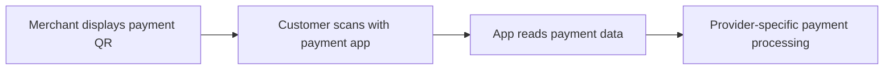
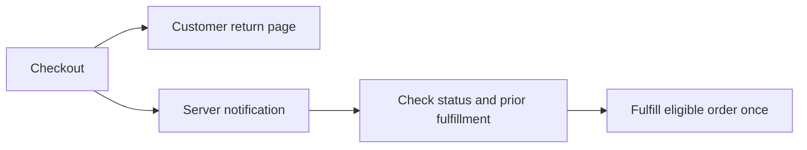

# Week 2 Learning Notes: Digital Payment Systems

Industry and Community Engagement · Learning log started on 8 September 2026

**Status:** In progress. These notes record the material I have covered and the questions I am developing. Course completion and certificates are recorded only after confirmation on the learning platform.

## My learning focus

My Week 1 work considered e-commerce. In Week 2, I am examining how digital financial services support online transactions and how this knowledge can contribute to my professional development. I want to explain the purpose of a financial technology, the people and organisations involved, and the limits of the benefits it promises.

The Week 2 lecture also connected independent learning with a professional portfolio and personal development planning. I am using the online courses to build subject knowledge, then turning that knowledge into examples, critical observations and practical next steps. A completion certificate will establish completion; the notes and applied examples will show what I can explain and use.

My Week 1 reflection linked my PDP to teamwork, checking original sources and explaining a practical service challenge. I carry those priorities into this week through purposeful communication with my teacher and analysis of the payment experience. The provider-documentation check below is one completed step; implementing a service or conducting user testing remains future work.

## Course 1 — Introduction to Fintech

Source: Corporate Finance Institute, [Introduction to Fintech on LinkedIn Learning](https://www.linkedin.com/learning/introduction-to-fintech).

**Completion:** Completed on 8 September 2026. The official LinkedIn Learning certificate records the 49-minute course. My local evidence includes a study photograph, a course screenshot, separate course notes and the certificate.

### What I understand by FinTech

I understand FinTech as the use of technology to improve financial products, services and processes. Digital payments are one part of this field. Other areas include banking, funding, investment management, insurance and compliance.

The course gives me three useful questions for evaluating an application:

1. Does it improve access to financial services?
2. Does it improve the customer experience or the efficiency of a process?
3. How does it change the services and choices available in the market?

These questions give me a basis for analysis. A claim about convenience or inclusion still needs evidence from the specific product and setting.

### Development of digital finance

| Broad period discussed in the course | Developments | Connection I draw |
| --- | --- | --- |
| Late 1990s and 2000s | Online payments, online lending, mobile financial services and automated investment services | Internet access created new ways to deliver financial services and support e-commerce. |
| 2010s | Digital wallets, mobile payments, crowdfunding, blockchain, InsurTech and open banking | Smartphones and data connectivity brought financial services into everyday activities. |
| 2020s | Wider use of digital banking, AI and machine learning, digital identity and decentralised finance | Increasing digitisation creates opportunities alongside questions about identity, trust and control. |

I use this timeline to organise the course's broad themes. It does not imply that every technology or company first appeared in the period in which it is discussed.

### Online payments and digital wallets

I distinguish payment processing from funds transfer. Payment processing includes receiving, validating and authorising an electronic payment. A funds transfer concerns money moving between accounts or people, including domestic and international transfers.

A digital wallet provides a way to initiate payments and manage financial information or assets. It can connect to other services and infrastructure. I therefore need to distinguish the wallet interface, a payment service provider, a card network and a bank when describing a particular transaction.

**My applied example:** In a hypothetical online purchase, a customer selects a mobile wallet at checkout. The merchant uses a payment service to accept the transaction, and other financial participants support authorisation and the movement of funds. This example helps me connect the visible checkout experience with the processes behind it.

### Applying the learning — a QR payment example

EMVCo distinguishes two payment modes: a customer can scan a merchant's QR code, or display a code for the merchant to scan. Its specifications define the QR data format; providers determine subsequent payment messaging. This helps me separate the payment entry point from the processing behind it. [Source: EMVCo, EMV QR Codes](https://www.emvco.com/emv-technologies/qr-codes/).

My diagram illustrates the first mode at a conceptual level:

**My analysis:** I would examine what happens if the app reads unexpected payment details, the network fails, or the payment status is unclear. A useful design should help the customer check the intended recipient and understand the result before deciding whether to retry. These are evaluation questions for my scenario, to be checked against a specific provider's documented behaviour.

I also checked EMV payment tokenisation. It substitutes a payment token for the primary account number and can constrain token use to a device, merchant or payment scenario. My takeaway is that payment security can involve limiting the usefulness of exposed data. [Source: EMVCo, EMV Payment Tokenisation](https://www.emvco.com/emv-technologies/payment-tokenisation/).

### Digital banking and financial inclusion

The course refers to neobanks as digital banks. Online platforms and mobile applications can provide services such as opening accounts, applying for loans and managing investments. Reducing dependence on physical branches can make some services easier to access and allow providers to automate processes.

**My critical observation:** Access to an application is only part of financial inclusion. A person may still face barriers involving internet access, a suitable device, digital skills or identity requirements. When I evaluate a service, I need to ask which users benefit and which users may remain excluded.

The course also raises deposit protection. I should examine the entity providing a service and the applicable protection arrangements when studying a specific digital bank. A convenient interface does not by itself establish the provider's regulatory status or the protection available.

### Alternative funding

Alternative funding includes ways of obtaining finance beyond a conventional bank loan. The course introduces online lending, peer-to-peer lending and crowdfunding. My focus is on identifying who supplies the money, what the platform does, and what the funder receives in return.

Peer-to-peer lending connects borrowers with lenders through a platform. Crowdfunding gathers contributions from many participants and can involve different arrangements, including rewards, equity or debt. These arrangements should not be treated as equivalent: a reward is different from ownership, and both differ from a repayment obligation.

**My critical observation:** A faster application or wider access to funding does not remove credit or project risk. I need to discuss the conditions behind the benefit, including repayment obligations, information quality and the possibility that a borrower or project may fail.

### What the first chapter quiz helped me consolidate

The questions reinforced the connection between smartphones and mobile payments, the meaning of digital banking, and the role of technology in widening access to financial services. They also helped me distinguish broad personal finance functions from narrower activities such as investment advice.

The four chapter quiz results were confirmed as **5/5, 8/8, 4/4 and 3/3**, giving **20/20** overall.

### Personal finance, insurance and AI

Personal finance management tools can aggregate account information, track spending and support budgeting. Accounting automation can reduce repeated work in bookkeeping, expense tracking, invoicing and reporting. I connect both applications to data quality: incorrect inputs or categories can affect the conclusions drawn from a dashboard or report.

InsurTech applies technology to activities such as underwriting, claims and risk assessment. The course's examples include vehicle data and insurance linked to usage. This makes me consider a trade-off between personalisation and the amount of information collected about a customer.

AI and machine learning can identify patterns or anomalies, support fraud detection, automate service tasks and assist investment analysis. I understand machine learning as a part of the broader field of AI.

**My critical observation:** For a payment fraud model, I would evaluate both missed fraud and legitimate payments incorrectly flagged. A system that blocks many genuine customers could undermine the convenient payment experience it is supposed to support. I would also examine how a flagged decision can be reviewed and how changing transaction patterns affect performance.

### RegTech and consumer protection

RegTech supports organisations with compliance tasks such as identity verification, monitoring, risk management and reporting. I distinguish the provider of a compliance tool from the regulator responsible for oversight.

The course links regulation to consumer protection, financial stability, the prevention of financial crime and conditions for innovation. For a digital payment service, I would examine whether costs and risks are understandable, how account and transaction information is protected, and how a customer can obtain help when something goes wrong.

**My critical observation:** Automation needs accountable review. An identity match or transaction alert can require further investigation, and a report depends on the quality of its source data. If I refer to a particular legal obligation or reporting deadline, I will verify the original rule and its conditions with the relevant authority.

The course also introduces regulatory sandboxes as a way to test innovation under controlled conditions and discusses cooperation between authorities when services operate across borders. This connects product design with the scope of a test, the evidence it should produce, and the jurisdictions in which a service operates.

I checked the GDPR example against Article 6. Consent is one legal basis for processing; the Article also includes contractual necessity and legal obligations. This showed me why an introductory quiz answer needs context before I use it in a formal analysis. [Source: GDPR, Article 6](https://eur-lex.europa.eu/eli/reg/2016/679/art_6/oj/eng).

### Evaluating future technologies

| Direction discussed in the course | Possible application | What I would investigate |
| --- | --- | --- |
| VR and AR | Virtual service interactions, financial education and visualisation | Whether the experience improves understanding or task completion, and who can access the required equipment. |
| Quantum computing | Risk modelling and portfolio optimisation | A clearly defined problem, a comparison with existing methods and realistic operating conditions. |
| Blockchain and DeFi | Peer-to-peer exchange and smart contracts | How rules and inputs are checked, and how errors or disputes are handled. |
| AI in financial regulation | Support for compliance, analysis and service tasks | Output quality, oversight, review and the ability to trace a decision. |
| Wearables and the internet of things | Contactless payments and personalised services | Convenience alongside the scope of data collection and meaningful user control. |

I treat the future-facing examples as directions to evaluate. Their value depends on evidence from the intended setting. I can use the same method across topics: identify the user need, explain the process, examine the conditions and risks, and check whether the claimed improvement is demonstrated.

### What this changes in my approach

My Week 2 analysis now has a more specific structure. I can connect the customer-facing payment experience to the organisations, data and controls behind it. The QR diagram made me distinguish an entry point from payment processing; the GDPR source check showed why precise conditions matter when I use a course example.

For my next development step, I will take one documented payment flow and explain its participants, normal result and failure handling. I will assess my understanding by explaining the flow in my own words and identifying a convenience benefit, an access barrier and a security consideration. This gives me a concrete basis for updating my PDP and preparing the Theme 2 reflection.

## Course 2 — Digital Marketing Foundations

Source: Brad Batesole, [Digital Marketing Foundations on LinkedIn Learning](https://www.linkedin.com/learning/digital-marketing-foundations-26945172). The version I am studying was published on 26 September 2025 and is listed as 2 hours 9 minutes. **Status: in progress.**

### Discussing the course version with my teacher

The original module link opened the archived 2022 edition. I asked my teacher whether I could use the newer edition and received confirmation that this was acceptable. I then changed to the updated course on 8 September 2026.

This gave me a practical example of taking responsibility for my learning: I identified a change in the resource, checked that an alternative met the teacher's expectations, and adjusted my study plan. I am retaining the two course links and page screenshots to explain the change. The record of the discussion is my account of the conversation; the screenshots show the course pages.

Original link: [Digital Marketing Foundations (2022)](https://www.linkedin.com/learning/digital-marketing-foundations-15054577/connecting-with-customers-online).

### My starting understanding

The opening lesson connects digital marketing with using channels, data and technology to reach customers. The updated course discusses AI-assisted content creation, predictive content and real-time recommendations. I distinguish these functions: producing a draft, estimating what may interest a group, and adapting a recommendation are different tasks with different evidence requirements.

My connection to Week 2 is the journey from a customer's first contact with a business to a completed payment. I want to understand which information builds confidence and how a payment experience supports or interrupts the customer's intended action.

**My critical observation:** A relevant recommendation may encourage a purchase, but predicted interest does not establish what an individual wants. I will examine how a proposed use of customer data relates to the task, what the customer understands about it, and how the result can be checked.

### AI, privacy and a connected customer experience

The next lesson connects changing tracking practices with greater attention to first-party data, discusses generative AI for content production, and explains omnichannel experiences. I understand first-party data in terms of the direct relationship through which it is collected; I still need to examine the purpose and conditions of a specific use.

Omnichannel marketing focuses on continuity across customer touchpoints. The course's shopping-cart example helps me distinguish this from simply operating several channels. For a payment scenario, I would investigate whether the order, amount and payment status remain understandable when a customer changes device. I would test inconsistent data or repeated submissions before claiming that the journey is reliable.

**My critical observation:** Generating content variants quickly is useful only when the information is accurate and appropriate. I would check product facts and misleading wording before evaluating engagement. A faster workflow still needs a clear review step.

### Paid, owned and earned media

I distinguish paid placement, channels and content a business manages, and attention generated through other people's sharing or commentary. One social platform can contain all three. I therefore classify the activity by how it is produced and distributed, rather than by the platform name alone.

For my payment example, I would compare the promise made in an advertisement, the information provided at checkout, and customers' accounts of the experience. An unclear fee or payment result could weaken the confidence created earlier in the journey. This is a hypothesis to investigate in a defined scenario.

### From the marketing funnel to the payment journey

The course uses awareness, interest, desire and action to organise the marketing funnel, then adds loyalty and advocacy after purchase. I use these stages as a guide while recognising that customers may pause, compare alternatives or return later.

The buyer-journey lesson explicitly connects hesitation with unclear prices, confusing websites and limited trust in online payments. This gives me a direct link between the marketing course and digital payment systems.

**My applied exercise:** For a hypothetical mobile purchase, I would follow product discovery, comparison, the shopping cart, payment selection, confirmation and support. At each point I would record the customer's task, required information and possible barrier. At checkout, I would examine the total cost, supported methods, verification steps and the meaning of the final payment status.

This exercise has not been tested on a live service. I have now taken a first verification step by reading a provider's fulfillment documentation, as recorded below.

### Checking a documented payment process

I checked Stripe's Checkout fulfillment guide. A payment can succeed even if the customer loses connectivity before reaching the return page. Its documented approach uses server notifications, checks payment status and prevents repeated order fulfillment; delayed payment methods need later success or failure handling. [Source: Stripe, Fulfill orders](https://docs.stripe.com/checkout/fulfillment).

My conceptual diagram records the distinction:

**My inference:** A clear confirmation page and dependable order processing must work together. I would check that a customer can understand a pending result and that repeated notifications cannot create duplicate fulfillment. This is documentation analysis; I have not implemented or tested a payment integration.

### Personalisation and learning through feedback

The course distinguishes recommendations, actions triggered by customer behaviour and dynamically adapted content. I would consider alternative explanations for a signal: visiting a pricing page could indicate comparison or confusion as well as an intention to buy. My proposed trigger should be evaluated against customer feedback and the risk of unwanted interruptions.

Agile marketing uses repeated cycles of planning, action, feedback and adjustment. I connect this with my learning method: explain a concept through a concrete question, identify what I cannot yet support, and check or revise it. Asking my teacher about the course version and consulting a payment provider's documentation are two actions I have already taken in this study session.

### Defining value in terms a customer can assess

The value-proposition lesson asks me to connect a customer problem, a useful outcome and a reason to choose the proposed solution. For my hypothetical checkout scenario, supporting several payment methods is a feature; helping the intended customer find a usable method and understand the payment result is the intended experience.

My draft aim is to provide a clear mobile checkout that explains the amount, available methods and next step. I have not demonstrated an advantage over another service. A meaningful comparison would need a specified alternative and common evaluation criteria.

### Identifying an audience without assuming its needs

Segmentation groups customers using relevant characteristics, interests or behaviour. For my checkout example, I would start with tasks and context: a first-time visitor, a returning user and a person with limited connectivity may need different support. These are hypotheses to validate, rather than established findings about real customers.

AI clustering can suggest patterns, but I would examine the data and the reason for each grouping. More detailed segmentation is useful only when it helps answer a meaningful question and is supported by suitable evidence.

### A provisional customer persona

I drafted a persona for the applied exercise: a first-time mobile customer who wants to understand the full amount, choose a usable payment method and confirm the order outcome. The proposed support includes understandable verification steps, clear status messages and a visible help route.

This persona organises my questions. It has no invented interview quotations or survey findings. The course's emphasis on evolving personas means I would revise it using observed behaviour and customer explanations, rather than treating the initial profile as a fixed description.

### Setting a measurable development goal

The SMART framework helps me specify an outcome, how I will assess it and when I will complete it. I would interpret views or likes in relation to a defined purpose; they do not independently demonstrate sales or a better customer experience.

My proposed PDP action is to complete an annotated payment-journey analysis by **15 September 2026**, using official sources and comparing three situations: verified success, a payment still processing and a browser that has not displayed the result. I will identify the participants, required customer information, a convenience benefit and an access or reliability limitation. I have completed the initial documentation check; the full scenario comparison is a further step.

### KPI exercise: the denominator changes the question

The course connects KPIs with the purpose of a campaign and discusses weighted engagement and LTV:CAC. I would state the weighting, time horizon and cost or value definitions before interpreting either measure.

For a calculation exercise, I used **hypothetical data**, not customer records or project results: 500 sessions, 80 sessions starting checkout and 40 purchasing sessions in the same observation period, with at most one counted purchase conversion per session.

| Measure | Calculation | Result |
| --- | --- | --- |
| Session visit-to-purchase conversion | 40 / 500 | 8% |
| Completion among sessions that started checkout | 40 / 80 | 50% |

Both results are compatible. They answer different questions. Before claiming that conversion improved, I would specify the event, denominator, period and comparison. The exercise demonstrates my understanding of the measure; it does not demonstrate a real performance improvement.

### Bringing the example into a compact plan

| Element | My current draft for the hypothetical shop |
| --- | --- |
| Problem and audience | A first-time mobile customer may need clearer checkout information. |
| Intended value | Understand the amount, available payment methods and next step. |
| Proposed content | Explanations at checkout, confirmation and help touchpoints. |
| Business connection | Support an intended purchase and provide understandable order information. |
| Costs to consider | Content creation, maintenance and customer-support time; no cost estimate has been established. |
| Measures | Defined visit-to-purchase and checkout-completion measures, alongside customer understanding. |
| Review | Compare documentation and pages, then revise the plan using feedback. |

The one-page-plan lesson helped me check whether the audience, message, proposed service and measures support the same purpose. I can update this draft as the evidence develops.

### Asking useful data questions and understanding growth loops

The messaging lesson starts with the information needed to address a customer's concern. For my example, I would investigate how a first-time customer understands fees and payment instructions, then relate the findings to the wording at that touchpoint.

Growth loops connect an existing user's experience with the arrival of new users through mechanisms such as referrals or shareable features. I would evaluate useful participation and retention alongside sharing counts and incentive costs. In a payment setting, trust in the underlying service and control over what information is shared would shape my assessment.

## Course still to be developed

| Course assigned through the Week 2 learning materials | My planned focus | Status |
| --- | --- | --- |
| Leveraging Generative AI in Finance and Accounting | Examine useful applications, limitations and the need to check generated outputs. | Notes to follow after study. |

## My next steps and evidence of progress

| Action | Why it matters | Evidence I will produce |
| --- | --- | --- |
| Completed: FinTech course and chapter quizzes | Build a more complete account of the field and identify misunderstandings. | Learning notes, four completed quizzes and the official course certificate. |
| Completed: first provider-documentation check using Stripe Checkout | Examine a specific payment process alongside the earlier conceptual QR example. | A source-backed diagram and analysis of confirmation, delayed status and repeated fulfillment requests. |
| Compare convenience, inclusion and risk in that scenario | Develop a balanced reflection supported by a concrete example. | A short analysis covering a benefit, a limitation and a response. |
| Study the remaining assigned courses | Extend the analysis to marketing and AI in finance. | Separate course notes and verified completion evidence. |
| Update my personal development plan before finalising Theme 2 | Turn the learning into an explicit development goal. | A specific goal, an action and a way to check progress. |

My learning photograph and course screenshot are retained with my local portfolio evidence. This repository provides a readable record of my notes and their development. It supports the portfolio alongside the required reflection and other evidence.

## Sources and related work

- Week 2 lecture supplied in the module learning materials, studied on 8 September 2026.
- Corporate Finance Institute, [Introduction to Fintech](https://www.linkedin.com/learning/introduction-to-fintech), LinkedIn Learning.
- Brad Batesole, [Digital Marketing Foundations, updated edition](https://www.linkedin.com/learning/digital-marketing-foundations-26945172), LinkedIn Learning, published 26 September 2025.
- EMVCo, [EMV QR Codes](https://www.emvco.com/emv-technologies/qr-codes/) and [EMV Payment Tokenisation](https://www.emvco.com/emv-technologies/payment-tokenisation/), consulted on 8 September 2026.
- European Union, [General Data Protection Regulation, Article 6](https://eur-lex.europa.eu/eli/reg/2016/679/art_6/oj/eng).
- Stripe, [Fulfill orders with Checkout](https://docs.stripe.com/checkout/fulfillment), consulted on 8 September 2026.
- [My Week 1 e-commerce repository](https://github.com/hansu650/ice-week1-ecommerce-poster).

The applied examples and critical observations above are my analysis of the learning material and the cited sources.
